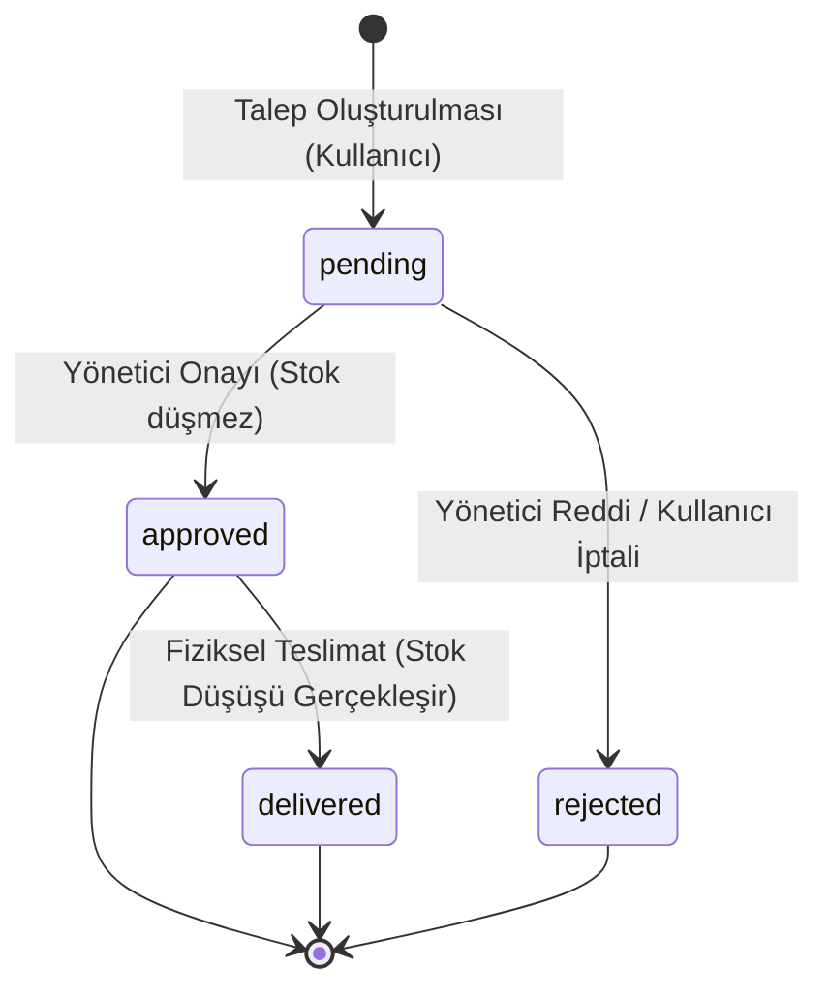

# GATİM - Envanter ve Talep Takip Sistemi Teknik Raporu

## 1. Proje Amacı ve Kapsamı
Gazi Teknoloji ve İnovasyon Merkezleri A.Ş. (GATİM), teknolojik altyapısı ve yenilikçi projeleri ile öne çıkan bir kurumdur. Bu dinamik yapıda, envanter yönetimi ve personel malzeme taleplerinin izlenebilirliği, operasyonel verimliliğin sürdürülebilmesi açısından hayati önem taşımaktadır. **GATİM - Envanter ve Talep Takip Sistemi**, kurum bünyesindeki tüm fiziksel envanter kalemlerinin, yazılım/donanım donanımlarının ve sarf malzemelerinin kayıt altına alınması, personelin bu malzemelere yönelik dijital ortamda talep oluşturması ve bu taleplerin belirli onay süreçlerinden geçerek fiziksel teslimatla sonuçlanmasını koordine etmek amacıyla geliştirilmiştir.

Sistemin temel hedefleri şunlardır:
- Envanter takibinin anlık ve şeffaf bir şekilde yapılması.
- Kağıt tabanlı ve manuel talep yönetim süreçlerinin dijitalleştirilerek hızlandırılması.
- Rol tabanlı yetkilendirme (RBAC) ile envanter güvenliğinin ve denetiminin artırılması.
- Envanter seviyelerinin kritik sınırlara düşmesi durumunda erken uyarı mekanizmalarının işletilmesi.
- Her talep durum değişikliğinin geriye dönük olarak denetlenebilir (audit log) şekilde kayıt altında tutulması.

---

## 2. Kullanıcı Rolleri ve Yetkilendirme Mimarisi (RBAC)
Sistem, Rol Tabanlı Erişim Kontrolü (Role-Based Access Control - RBAC) modeline dayanmaktadır. Uygulamada tanımlanan 3 temel rolün yetki sınırları aşağıda detaylandırılmıştır:

1. **Yönetici (Admin)**: 
   - Tüm sistem fonksiyonlarına tam erişime sahiptir.
   - Yeni departmanlar ve kategoriler tanımlayabilir.
   - Envantere yeni malzemeler ekleyebilir ve mevcut malzemeleri düzenleyebilir.
   - Tüm personel taleplerini görüntüleyebilir, onaylayabilir (`approved`), reddedebilir (`rejected`) veya fiziksel teslimatını gerçekleştirebilir (`delivered`).
   - Sistemdeki tüm kullanıcıları listeleyebilir ve kullanıcı rollerini güncelleyebilir (örneğin bir personeli "Envanter Sorumlusu" olarak atayabilir).

2. **Envanter Sorumlusu (Inventory Manager)**:
   - Envanter yönetimi ve talep karşılama süreçlerinden sorumludur.
   - Envantere malzeme ekleme ve mevcut envanter bilgilerini güncelleme yetkisine sahiptir.
   - Tüm personelin oluşturduğu talepleri listeleyebilir, onaylayabilir, reddedebilir ve teslim edebilir.
   - Kullanıcı yönetimi (kullanıcı rollerini değiştirme) sayfasına erişim yetkisi yoktur.

3. **Personel (Employee / User)**:
   - Sisteme üye olan ve envanterden malzeme talep eden standart kullanıcılardır.
   - Envanterdeki mevcut malzemeleri listeleyebilir, arayabilir ve detaylarını inceleyebilir.
   - Kendi ihtiyaçları doğrultusunda malzeme talebi oluşturabilir.
   - Sadece kendi oluşturduğu talepleri listeleyebilir.
   - Durumu henüz "pending" (beklemede) olan kendi taleplerini iptal edebilir. İptal edilen talepler sistemde "rejected" olarak etiketlenir ve açıklama kısmına "Kullanıcı tarafından iptal edildi" notu düşülür.
   - Envanter ekleme/düzenleme sayfalarına veya kullanıcı yönetim paneline erişmeye çalıştığında sistem tarafından `403 Forbidden` hata sayfasına yönlendirilir.

Erişim sınırları, Flask uygulamalarında decorators mimarisiyle çözülmüştür. Yazılan `@role_required` dekoratörü, `Flask-Login` oturumu üzerinden `current_user.role` bilgisini sorgular ve yetkisiz talepleri HTTP 403 status kodu ile sonlandırır.

---

## 3. Veritabanı Modelleri ve İlişki Eşleşmeleri
Veritabanı ilişkileri modern SQLAlchemy 2.x Declarative Mapping (`Mapped` ve `mapped_column`) standartları kullanılarak modellenmiştir. Sistemdeki 6 ana varlık (entity) arasındaki One-to-Many (Bire-Çok) ilişkiler şu şekildedir:

1. **Department (Departman) & User (Kullanıcı)**:
   - Her kullanıcının bağlı olduğu tek bir departman vardır (Örn: "Yazılım Geliştirme ve Ar-Ge").
   - Bir departmanda birden fazla kullanıcı çalışabilir.
   - İlişki: `Department.users` (One-to-Many) -> `User.department` (Many-to-One).

2. **Category (Kategori) & InventoryItem (Envanter Malzemesi)**:
   - Her envanter malzemesi tek bir kategoriye aittir (Örn: "Geliştirici Ekipmanları").
   - Bir kategoride birden fazla malzeme bulunabilir.
   - İlişki: `Category.items` (One-to-Many) -> `InventoryItem.category` (Many-to-One).

3. **User (Kullanıcı) & InventoryRequest (Envanter Talebi)**:
   - Bir personel zaman içerisinde birden fazla envanter talebinde bulunabilir.
   - Her envanter talebi mutlaka tek bir talep eden kullanıcıya aittir.
   - İlişki: `User.requests` (One-to-Many) -> `InventoryRequest.requester` (Many-to-One).

4. **InventoryItem (Malzeme) & InventoryRequest (Talep)**:
   - Bir malzeme için birden fazla talep açılabilir.
   - Her talep kaydı tek bir malzemeye işaret eder.
   - İlişki: `InventoryItem.requests` (One-to-Many) -> `InventoryRequest.item` (Many-to-One).

5. **InventoryRequest (Talep) & RequestLog (Talep İşlem Günlüğü)**:
   - Bir talebin yaşam döngüsü boyunca geçirdiği her statü değişimi (Oluşturulma, Onaylanma, Teslim Edilme vb.) tarihsel olarak loglanır.
   - Bir talebe ait birden fazla işlem logu bulunur.
   - İlişki: `InventoryRequest.logs` (One-to-Many) -> `RequestLog.request` (Many-to-One).

---

## 4. Envanter Talep Durum İş Akışı ve Stok Düzenleme Mantığı
Taleplerin oluşturulmasından fiziksel teslimata kadar geçen süreç katı bir durum makinesi (state machine) ve iş kuralı setine bağlıdır.

### Stok Düşüm Kararının Gerekçesi (Physical Delivery Logic)
Proje gereksinimlerinde yer alan en kritik iş kuralı: **"Talebin durumu 'approved' (Onaylandı) olduğunda envanter stok miktarı düşmez. Gerçek stok düşüşü, yalnızca durum 'delivered' (Teslim Edildi) olduğunda gerçekleşir."** şeklindedir.

Bu kuralın seçilme gerekçeleri şunlardır:
1. **Fiziksel Gerçeklikle Uyum**: Envanter yönetiminde dijital stok ile antrepo/depodaki fiziksel stok miktarının örtüşmesi gerekir. Bir malzemenin onaylanması, depodan fiziksel olarak çıktığı anlamına gelmez. Teslimat yapılana kadar geçen sürede malzeme depodadır ve kayıp/hasar durumunda hala kurumun sorumluluğundadır.
2. **Rezervasyon ve İptal Esnekliği**: Onaylanan bir talep, personel işten ayrıldığı, projeden vazgeçildiği veya yanlış talep açıldığı gerekçesiyle fiziksel teslimat öncesinde iptal edilebilir. Eğer stok düşümü "onay" aşamasında yapılsaydı, iptal durumunda stoğu geri eklemek için ek ters işlemler gerekecek ve veritabanı tutarsızlıklarına zemin hazırlanacaktı.
3. **Kritik Stok Kontrolünün Son Ana Bırakılması**: Talep onaylandığında depodaki malzeme miktarı yeterli olsa bile, fiili teslimat anına kadar depodan acil durumlar için başka malzeme çıkışları yapılmış olabilir. Stok düşümünün fiili teslimat anında yapılması, sisteme o anda depoda gerçekten yeterli malzeme olup olmadığını doğrulama şansı verir. Teslimat anında yeterli stok yoksa işlem engellenir ve hata verilir.

---

## 5. Yapay Zeka (AI) Destekli Geliştirme ve Giderilen Hatalar
Proje geliştirilirken karşılaşılan ve AI yardımıyla analiz edilip giderilen iki kritik hata aşağıda özetlenmiştir:

### Hata 1: pytest Modül Bulma Sorunu (`ModuleNotFoundError`)
- **Sorun**: Test suite çalıştırılmak istendiğinde `ImportError: No module named 'app'` hatası alınmaktaydı. Test dosyaları `tests/` dizini altında olduğundan, pytest çalıştırıldığı konumu arama yoluna (`sys.path`) eklemiyordu.
- **Çözüm**: Testlerin doğrudan `pytest` komutuyla değil, `python -m pytest` komutuyla çağrılması sağlandı. `python -m` parametresi, bulunulan çalışma dizinini otomatik olarak arama yolunun başına ekler ve uygulamanın import hiyerarşisini bozmadan testlerin çalışmasını sağlar.

### Hata 2: SQLite IntegrityError Sonrası Oturum Kilitlenmesi
- **Sorun**: `test_negative_quantity_constraints` testinde, veritabanı kısıtlamalarını (check constraints) test etmek amacıyla bilerek geçersiz negatif değerlerle `db_session.commit()` tetiklenmekteydi. Kısıt ihlali sonrasında session rollback yapılsa bile, geçersiz nesneler session'ın "new/dirty" listesinde kalmaya devam ediyor ve bir sonraki testin commit işleminde tekrar yazılmaya çalışılarak testlerin kilitlenmesine sebep oluyordu.
- **Çözüm**: Hata yakalandıktan sonra sadece `db_session.rollback()` çağrısı yapmak yerine, scoped session nesnesini tamamen sıfırlayan `db_session.remove()` metodu çalıştırıldı. Böylece bir sonraki test adımı için tamamen temiz ve sıfırlanmış bir veritabanı bağlantı oturumu oluşturulması sağlandı.

### Hata 3: POST Logout Session Sonlanmama Problemi
- **Sorun**: `test_stock_control` testi esnasında bir kullanıcı ile talep yapıldıktan sonra oturumu kapatıp yönetici kullanıcısıyla oturum açılmaya çalışılıyordu. Ancak çıkış yapmak için `client.post("/auth/logout")` gönderiliyordu. Logout rotası GET isteklerini kabul ettiği için bu istek 405/404 dönüyor ve oturum sonlandırılamıyordu. Sonuç olarak yönetici giriş yapmaya çalıştığında sistem "zaten oturum açık" diyerek personeli yönlendiriyor ve yönetici işlemlerini gerçekleştiremiyordu.
- **Çözüm**: Test kodundaki çağrı `client.get("/auth/logout")` olarak güncellendi. Bu sayede Flask-Login oturumu temizlendi ve test senaryosundaki rol geçişleri sorunsuz tamamlandı.

---

## 6. Test Kapsamı ve Güvenlik İncelemesi
Geliştirilen sistem, 28 adet birim ve entegrasyon testinden oluşan kapsamlı bir test paketi ile koruma altına alınmıştır. Testler aşağıdaki başlıkları kapsar:
- **Kimlik Doğrulama**: Kayıt olma, şifre eşleştirme, güvenli hashing ve oturum açma/kapatma süreçleri.
- **Erişim Yetkileri (RBAC)**: Standart kullanıcıların admin panellerine girmesinin engellendiği ve 403 döndüğü durumlar.
- **İş Kuralları**: Malzeme ekleme/düzenleme, talep limitleri ve fiili teslimat esnasında stok düşümü kontrolleri.
- **Veritabanı Kısıtlamaları**: Negatif stok veya sıfır adetli taleplerin SQLite seviyesinde engellendiğinin doğrulanması.

Güvenlik kapsamında; CSRF koruması (`Flask-WTF` entegrasyonu), Werkzeug şifre tuzlama (salting), güvenli oturum yönetimi ve XSS korumaları tam olarak konfigüre edilmiştir.

---

## 7. Gelecek Yol Haritası (Roadmap)
Sistemin ilerleyen fazlarında eklenmesi planlanan özellikler:
1. **QR Kod ile Malzeme Takibi ve scanning**: Her malzemeye atanacak benzersiz bir QR kod yardımıyla, personelin mobil cihazlar üzerinden QR kodu taratarak hızlıca malzeme detaylarına ulaşması ve saniyeler içinde talep kaydı oluşturabilmesi.
2. **Otomatik E-posta Bildirimleri**: Taleplerin durumu her değiştiğinde (Onaylandı, Reddedildi, Teslim Edildi) ilgili personelin ve yöneticilerin otomatik e-posta bildirimleri alması.
